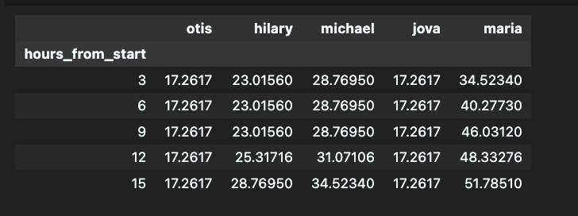
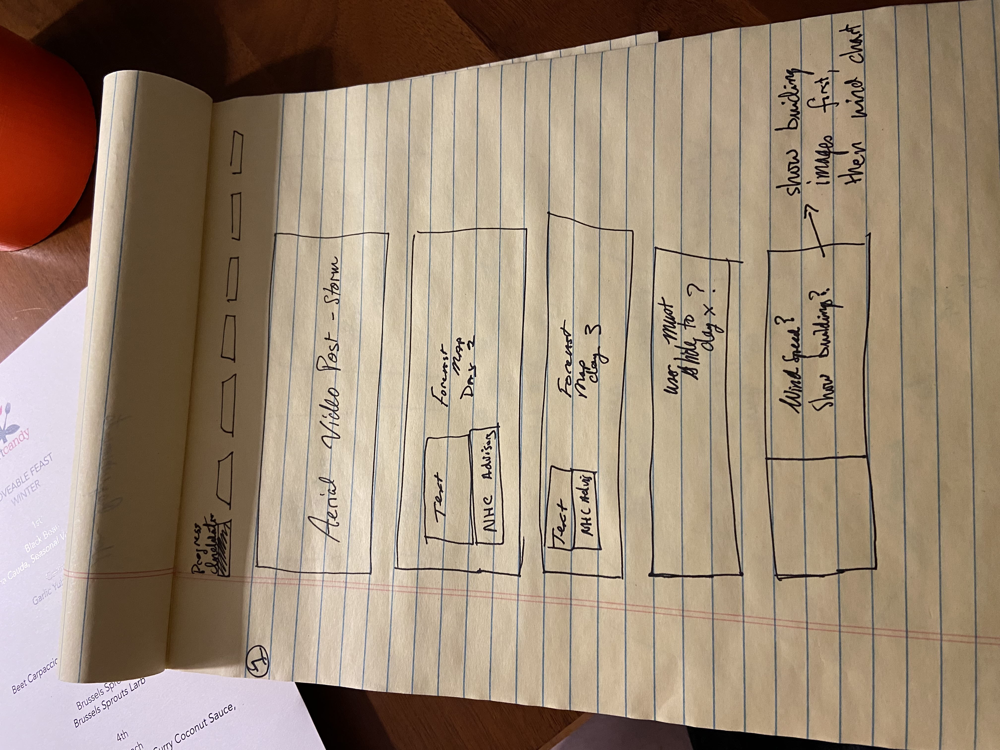

# Otis
*An exploration of Hurricane Otis, which devastated Acapulco, Mexico in Oct. 2023*

## TL;DR
This project was made as my Digital Mapping master's degree capstone in the spring of 2024. I am a career changer looking to transition into the climate journalism field. As such, I've modeled my final project after an article you might see in the *Washington Post* or *New York Times.* I've sought to differentiate the project from a typical article in two ways. One, by using the power of maps and graphics to help the reader understand how and why the storm intensified so quickly. Importantly, I've also focused much of the article on the human aspect of the storm. Yes, Otis is meterologically interesting and makes for a good story. But for the impacted residents, this is their lives now: destroyed homes, lost jobs, injured friends and families. Because I wrote this article nearly six months after Otis landed, I was able to get a perspective on the city's recovery that I haven't seen anyone else cover. I reached out to residents, aid organizations, city planners, meterologists and scientists to help me write this story. 

I used data from NOAA, the National Hurricane Center, NASA, and OpenStreetMap. My project is written using standard HTML/CSS/Javascript, aided by the MapLibre library, as well as QGIS. 

# Project Details
#### Project Motivation
Hurricane Otis made landfall as a Category 5 hurricane near Acapulco, a city of one million people in southwestern Mexico, at 1:25am local time, October 25, 2023. Mere hours before, the storm was an unnamed tropical depression not expected to pose any significant hazard to the city. 

Because the storm intensified so quickly, according to the National Hurricane Center wind speeds increased by 115 mph in 24 hours, Acapulco's residents had minimal time to prepare, much less evacuate. The storm caused catastrophic damage to thousands of buildings, including over 120 hospitals and medical clinics. Some officials report that Otis caused over $12 billion of damage to the city. 

Most tragically, the officially reported death toll stands at over 50, with at least one news outlet claiming the real toll is higher than 350.

In today's already-warmed climate, storms are not just becoming more intense. They are becoming more intense, **faster** and in they are becoming intense **in places they previously had not.** 
No matter what advances we make in clean energy in the future, we have already done so much damage to the environment that we must learn how to live with these more extreme weather events. Studying Otis can help us do that. 

#### Target User
The target user is a *New York Times* or *Washington Post* reader interested in the climate. These readers main motivation's are typically to understand the world better and keep up with current events. They will read the majority of their news on their phones. As such, I designed and built this project with a mobile-first approach. This user expects the graphics to be stunning, insightful, and the exact opposite of a cookie-cutter graph you could find on any random story about the topic. They also expect the reporting to be well-sourced, in-depth, and to make the story accessible.

## Data Acquisition, Wrangling, and Cleaning
Tools used:
- QGIS
- Illustrator
- Photoshop
- Python/Pandas
- Maplibre
- Map Tiler
- Open Street Map
- HTML/CSS/JS

[Forecast](https://www.nhc.noaa.gov/gis/archive_forecast_results.php?id=ep18&year=2023&name=Hurricane%20OTIS) and [best track](https://www.nhc.noaa.gov/gis/archive_besttrack_results.php?id=ep18&year=2023&name=Hurricane%20OTIS) data both come from the National Hurricane Center, a division of NOAA. Data provided by the NHC is typically well structured and cleaned, so I didn't have to do much on that front. However, there was still a lot of work needed to get the files workable for an interactive web map. The forecast files are provided in daily shapefile format. I needed to download ~two weeks worth of data, split the " forecasted best track lines" and "forecasted cones of uncertainty" features into seperate files, and then combine the respective groups into a "lines" geojson and a "cones" geojson.  I did that using QGIS and repeated a similar process for the post-hoc best track data (different from the forecasted version). I also used QGIS to do a few field calculations, like converting knots to mile-per-hour.

Gathering the [Sea Surface Temp](https://podaac.jpl.nasa.gov/dataset/MUR-JPL-L4-GLOB-v4.1#) (SST) data was a major challenge. After much clicking around, I found what I needed via NASA. (The agencies that control climatological data are huge, use very esoteric language, and often have websites that aren't exactly easy to navigate.) The provided data is in raster format. Each day's file covers the entire world and, consequently, the files are huge. If I attempted to process more than one day at a time or more than one step at a time without saving, QGIS would crash. I had to be very methodical and careful handling this data. I imported each day into QGIS, clipped the raster by an extent (which took my several tries to find one that worked), exported as a geoTIFF, and then uploaded into photoshop to do some retouching / contrast enhancement. Once I did that for all four days, I uploaded the files into Illustrator. Then, I aligned the layers, created the land layer, city label, and temperature legend for each day. Once that was set, I exported into Photoshopped where I was able to create the gif. This entire process took multiple days. I experimented with every single step: layer extents, colors, gif speed, which tools to use, legend location, land tones, label design, and on and on. I am quite happy with the way it turned out. 

I used [Wind Speed](https://www.nhc.noaa.gov/gis/archive_besttrack_results.php?id=ep18&year=2023&name=Hurricane%20OTIS) data from the NHC best track archives. I downloaded the different data files as CSVs. Combined them into a single CSV using Google Sheets (quick and easy for something simple like this) and then did a small amount of wrangling in Python using Pandas. The [jupyter notebook](data/hurricane_winds.ipynb) is included.

As for any web map, [Open Street Map](https://www.openstreetmap.org/#map=14/16.8503/-99.8516) was critical here. In particular, Humanitarian Open Street Map. I originally planned to use the data they provided to create outlines of every damaged building. That turned out to be less impactful than I hoped because virtually every single building was outlined. I ended up using the [Beer Slider](https://github.com/pehaa/beerslider) JS plug-in to create a before/after image slide. The slides, especially the one of the marina, are exceptionally powerful. Even though I didn't end up using the HotOSM data, working through that iteration was critical to the creative process (and to understanding the scale of the damage across town).

[Landslide data](https://maps.disasters.nasa.gov/arcgis/home/item.html?id=78f299478c3746c19642c97ed4977cca) comes from NASA's Disaster program. The NHC reported "numerous" fatalities were there direct result of landslides, but the damage they caused extends far beyond. The landslides mostly damaged the outskirts of town in the Sierra Madre del Sur mountains, but they took out roads, power lines, and cell towers, leaving the city without electricity or internet, and aid workers with limited access in/out of Acapulco.

## Design
I knew fromt he beginning that a "scrollytelling" style would work really well for this. I envisioned the user following the storm's path with each "step" of the scrollystory, but I didn't know exactly how it would look. 
I started with a [user requirements doc](https://docs.google.com/document/d/1WaK-PbLPVAWRV1UYZs48VkjoPQ9TkCIjxpP0T2TBLrY/edit?usp=sharing) where I listed out both the UX and technical requirements. 
I made a few rough hand-drawn sketches, e.g.  and then moved into illustrator to create a more detailed wireframe: 

A few examples I used for inspiration:
[Sydney Opera House at Rest](https://stories.sydneyoperahouse.com/sydney-opera-house-at-rest/)
[The Lost Tablet](https://www.bbc.co.uk/news/extra/8iaz6xit26/the-lost-tablet-and-the-secret-documents)
[A Voice from Ukraine](https://story.internal-displacement.org/the-road-was-long-a-voice-from-ukraine/index.html)
[Belt and Road Initiative](https://nikkei.shorthandstories.com/road-to-nowhere-china-s-belt-and-road-initiative/)

## Contact
Want to get in touch?

michael.sparks13@gmail.com

